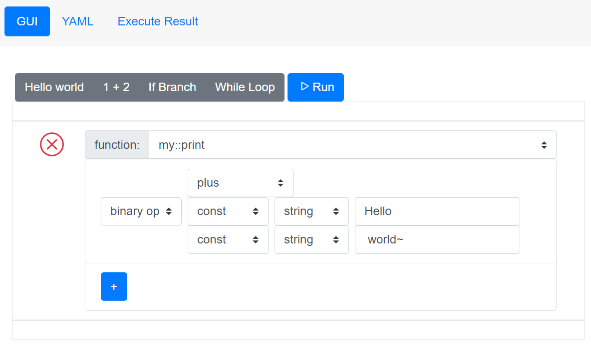

# Cablin


## Introduction

Cablin is a schema targeting in easily scripting in GUI and providing an easily-parsed exchange data form.

Script schema support:

* Variable declaration/assignment
* Value: int, int64, float, bool, string
* Basic logic: if-else branching, while loop with break command or continue command
* Self-defined function
* Package import
* **Imbedd package function**

A schema spec can be read [here](/user-guide/schema-spec).

The Cablin interpreter currently supports YAML, a human-readable exchange form.

## Try GUI Demo Online

Here we provided a Cablin UI demo. The UI Demo support:

* Variable declaration
* Variable assignment
* If-else branching
* while loop
* Operator
* Package import

[➡ Cablin UI Demo](https://mudream4869.github.io/cablin-ui/)



## Small Cablin Example in YAML

The code shown below is the **Hello World** script of Cablin.

```yaml
- import: io

- func:
    name: main
    body:
      - call:
          name: io::print
          params:
            - const:
                type: string
                value: Hello world
```

## Demonstration of the Example

```yaml
# Import io package, because we need `io::print` function.
- import: io

# Declare the main function.
# The function with the name "main" will be the entrance point
# when executing the script.
- func:
    name: main

    # Body is a list of "command"
    body:

      # Call a function which named "print" in io package
      - call:
          name: io::print

          # Params describe the parameters pass to the function
          # We pass a string to print "Hello world"
          params:
            - const:
                type: string
                value: Hello world
```

## Credits

* Created my free logo at [LogoMakr.com](https://logomakr.com).
